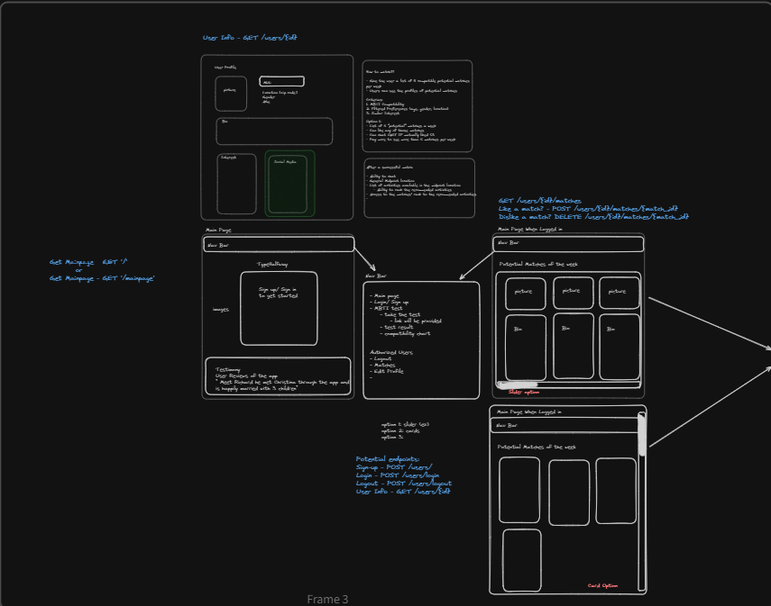
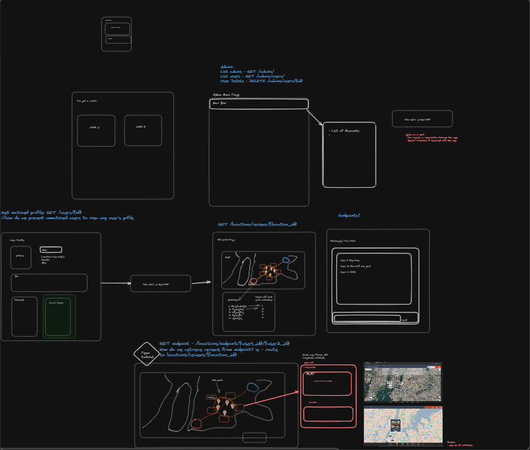
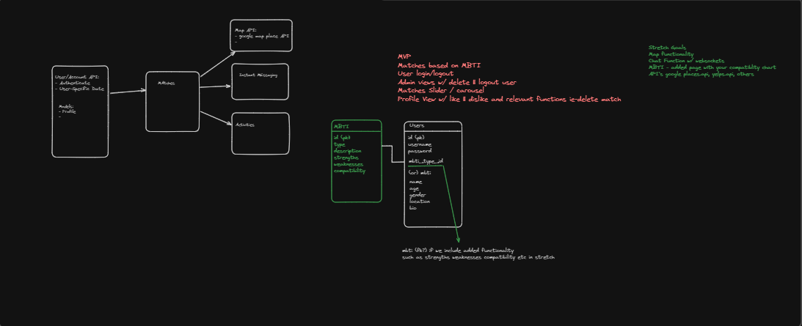

## Halfway

## Halfway Harmony(Group 14)

- Moses Junhan An
- Jay Santana
- Matthew Synder
- Timothy De Leon

## Intended Market

Halfway is intended for MBTI enthusiasts who are seeking a new friend or partner.

## Design

Halfway is a match making app that is built on MBTI (Myers-Briggs Type Indicator). When users sign up for Halfway, they choose their MBTI to determine their personality type.MBTI helps us understand their preferences, characteristics, and compatibility with others. Based on this information, our algorithm suggests potential matches for each user. After, our algorithm retrieves 5 potential matches the user has the ability to like the potential matches and if the like is mutual the user will move to their "Match list". Here the user can see who they've previously matched with and see how far they are from eachother.

We ask our users to come prepared with their MBTI type before signing up to make the process of finding your match easy. If users do not know their MBTI feel free to visit our landing page and click the link that'll take you to the test.

To build this app our team utilized FastAPI, Python, JavaScript, and RESTful APIs on the backend. On the frontend we used React, Bootstrap, and CSS.

## Halfway Wireframe Diagram

## Clone The Repository

Make a directory that you would like to clone this repository to

retrieve the clone link from gitlab at https://gitlab.com/santana.jazel/module3-project-gamma

Change into the directory you would like to clone this project to and run the git clone command following the link to the repository.

## Localhost

To view the FastAPI Documentation, is located at http:localhost:8000/docs

The default settings to view the React Front end, is located at http:localhost:3000

For the Database, is located at http:localhost:8082

## Install Extensions

- Prettier: <https://marketplace.visualstudio.com/items?itemName=esbenp.prettier-vscode>

## Project Setup

1. Clone the repository down to your local machine
2. CD into the new project directory
3. Make .env variables for "SIGNING_KEY", "REACT_APP_API_HOST", and "DATABASE_URL"
4. create docker volume pg-admin and project-gamma-data
5. run docker-compose up --build
6. route to localhost:3000/login to begin your journey!
